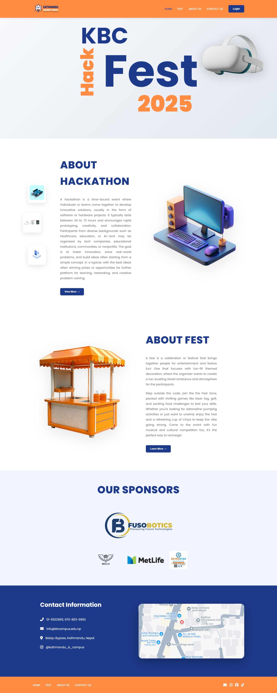

# KBC-HackFest

**KBC-HackFest** is the **visitor-facing interface** for KBC.  
It provides a **clean, responsive, and interactive frontend** designed to deliver a seamless experience to visitors.

---

## 🚀 Features

- **Modern, responsive design** for all devices  
- **User-friendly interface** for easy navigation  
- **Interactive pages** to explore information efficiently  
- **Optimized performance** for fast loading  

---

## 🛠️ Technologies Used

- **HTML5** – Web page structure  
- **CSS3** – Styling and responsive design  
- **JavaScript** – Dynamic interactions  
- **Flexbox & Grid** – Layout and alignment  

---

## 📸 Screenshots

**Home Page** 

